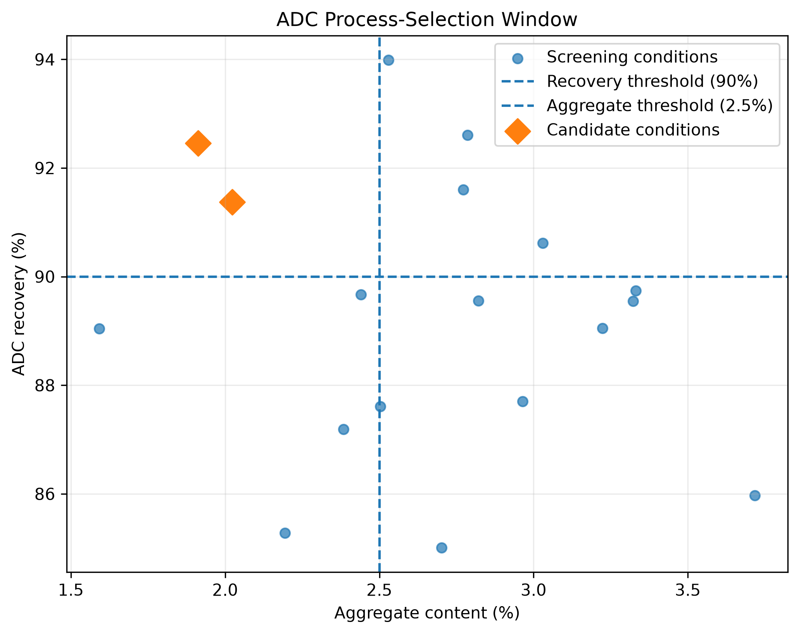
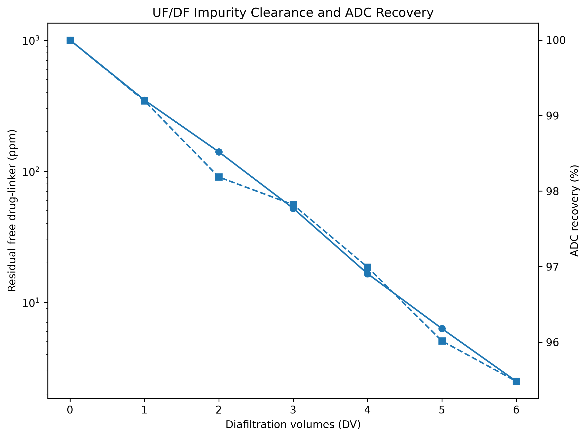

# Data-Driven Development of an ADC Downstream Purification Process

A simulated bioprocess-development case study exploring how process data can
be used to support downstream purification decisions for an antibody-drug
conjugate (ADC).

The project combines protein purification and downstream-process concepts with
Python-based data analysis to investigate trade-offs between product recovery,
small-molecule impurity clearance, aggregation, and ADC product quality.

> **Project status:** Work in progress. The project is being developed
> incrementally alongside ongoing training in Python and data analytics.

## Project objective

Following antibody-drug conjugation, downstream processing must remove
process-related impurities and undesirable product variants while maintaining
product recovery and critical quality attributes.

This project models a hypothetical post-conjugation ADC purification campaign
and addresses the question:

> **Which downstream process conditions provide the best balance between ADC
> recovery and product quality?**

All process-response data used in this repository are **simulated**. They are
designed to represent plausible process-development scenarios and do not
represent experimental measurements from a specific ADC, resin, membrane, or
manufacturing process.

## Hypothetical molecule

The case study considers a hypothetical:

- IgG1 antibody-drug conjugate;
- cysteine-based conjugation strategy;
- hydrophobic small-molecule payload;
- target mean drug-to-antibody ratio (DAR) of approximately 4.

The post-conjugation material is assumed to contain the desired ADC together
with free drug-linker, aggregates, residual small molecules, and ADC product
variants.

## Downstream process

The modeled downstream process consists of two unit operations:

```text
Post-conjugation material
        |
        v
      UF/DF
        |
        v
Multimodal chromatography
        |
        v
   Purified ADC
```

### 1. Ultrafiltration/diafiltration (UF/DF)

UF/DF is modeled as the initial cleanup and buffer-exchange operation.

The main development objective is to reduce residual free drug-linker while
maintaining ADC recovery.

Diafiltration volumes from 0 to 6 DV were evaluated using a simplified
exponential small-molecule clearance model.

### 2. Multimodal chromatography (MMC)

Multimodal chromatography is modeled as the polishing operation.

A full-factorial screening design evaluates three process parameters:

| Parameter | Screening levels |
|---|---|
| pH | 5.5, 6.5, 7.5 |
| NaCl concentration | 50, 150, 300 mM |
| Load density | 10, 25 mg ADC/mL resin |

This produces **18 simulated process conditions**.

The main responses evaluated are:

- ADC recovery (%);
- aggregate content (%);
- residual free drug-linker (ppm);
- mean DAR.

## Multimodal chromatography results

Exploratory analysis showed a trade-off between ADC recovery and aggregate
clearance.

The highest individual recovery was observed at:

- pH 6.5;
- 150 mM NaCl;
- 10 mg ADC/mL resin;
- ADC recovery: 93.99%;
- aggregate content: 2.53%.

However, maximizing recovery alone did not provide the strongest overall
process outcome.

Using hypothetical screening criteria of:

- ADC recovery >= 90%;
- aggregate content <= 2.5%;

two candidate conditions were identified.

The preferred preliminary MMC condition was:

| Parameter / response | Selected value |
|---|---:|
| pH | 6.5 |
| NaCl | 300 mM |
| Load density | 10 mg ADC/mL resin |
| ADC recovery | 92.45% |
| Aggregate content | 1.91% |
| Residual free drug-linker | 16.65 ppm |
| Mean DAR | 3.95 |

This condition sacrificed a small amount of recovery relative to the
maximum-recovery condition while providing improved aggregate clearance.



## UF/DF results

The UF/DF simulation started with a hypothetical residual free drug-linker
concentration of 1000 ppm.

Increasing diafiltration volume resulted in rapid small-molecule clearance
while ADC recovery decreased gradually.

Two hypothetical development criteria were applied:

- residual free drug-linker <= 20 ppm;
- ADC recovery >= 96%.

Both 4 DV and 5 DV satisfied these criteria.

A **5-DV endpoint** was selected because it reduced residual free drug-linker
to 6.30 ppm while maintaining 96.02% ADC recovery.



## Integrated process recovery

The selected unit-operation recoveries were:

| Process stage | Step recovery |
|---|---:|
| UF/DF (5 DV) | 96.02% |
| Multimodal chromatography | 92.45% |

The estimated cumulative downstream recovery is:

**88.77%**

This illustrates how relatively small product losses at individual unit
operations accumulate across a downstream process.

## Key process-development observations

The simulated case study illustrates several general process-development
principles:

- maximizing recovery alone does not necessarily identify the preferred
  purification condition;
- impurity clearance and product recovery can represent competing objectives;
- process conditions can be screened systematically rather than selected from
  a single response;
- explicit decision criteria can help identify promising operating conditions;
- cumulative recovery should be considered across the complete downstream
  process.

Because the dataset is simulated, these observations demonstrate the analytical
workflow rather than establishing experimental conclusions about a particular
ADC purification process.

## Repository structure

```text
adc-downstream-process-development/
|
|-- data/
|   |-- raw/
|   `-- processed/
|       |-- adc_mmc_screening_design.csv
|       |-- adc_mmc_simulated_results.csv
|       `-- adc_ufdf_simulated_results.csv
|
|-- notebooks/
|   |-- 01_process_design.ipynb
|   `-- 02_ufdf_development.ipynb
|
|-- results/
|   `-- figures/
|       |-- adc_process_selection_window.png
|       |-- adc_recovery_main_effects.png
|       `-- adc_ufdf_clearance_recovery.png
|
|-- README.md
|-- requirements.txt
`-- .gitignore
```

## Tools

The current analysis uses:

- Python
- NumPy
- Pandas
- Matplotlib
- Jupyter

## Reproducibility

Random-number generators use fixed seeds so that the simulated datasets can be
reproduced when the notebooks are rerun.

The analysis is organized into separate notebooks for multimodal
chromatography screening and UF/DF process development.

## Limitations

This project is a computational case study and does not contain laboratory
measurements.

The process-response relationships, numerical screening ranges, and acceptance
criteria are hypothetical. They are intended to create a realistic
data-analysis exercise and should not be interpreted as universal ADC process
parameters, regulatory specifications, or experimentally validated operating
conditions.

The current analysis focuses primarily on exploratory data analysis and simple
rule-based process selection. More advanced statistical modelling and process
optimization may be added as the project develops.

## Scientific context

Post-conjugation purification of ADCs requires control of product-related
variants and process-related impurities while maintaining product recovery.

Multimodal chromatography has been investigated for post-conjugation ADC
purification and can provide selectivity through combinations of interaction
mechanisms. UF/DF can support buffer exchange and clearance of low-molecular-
weight process impurities.

The project design was informed by published literature on ADC downstream
processing and post-conjugation purification, while all numerical datasets in
this repository were independently simulated for this case study.

## References

Matsuda, Y. (2022). Current approaches for the purification of antibody-drug
conjugates. *Journal of Separation Science*, 45(1), 74-86.
https://doi.org/10.1002/jssc.202100575

Keller, W. R., & Wendeler, M. (2021). Using multimodal chromatography for
post-conjugation antibody-drug conjugate purification: A methodology from high
throughput screening to in-silico process development.
*Journal of Chromatography A*, 1653, 462378.
https://doi.org/10.1016/j.chroma.2021.462378